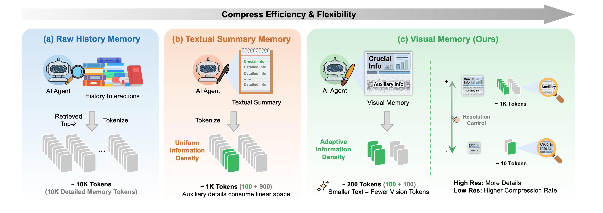
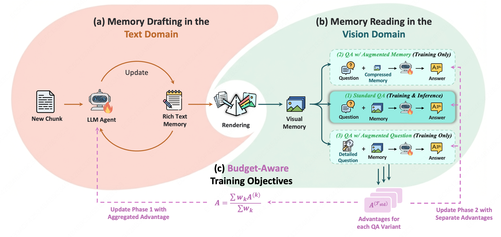
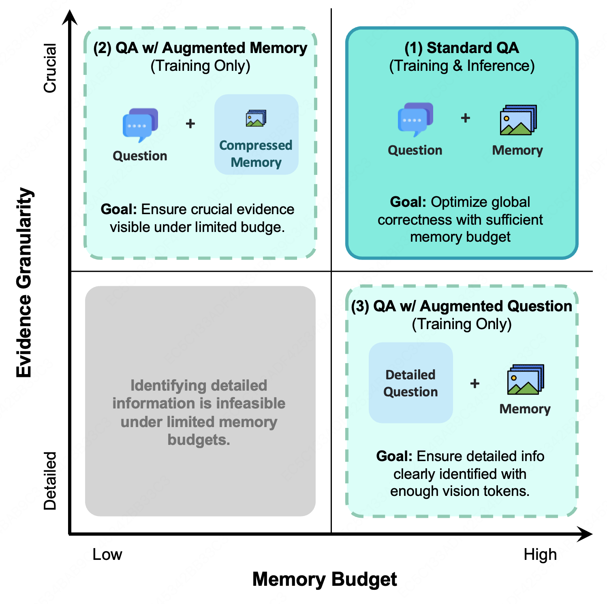
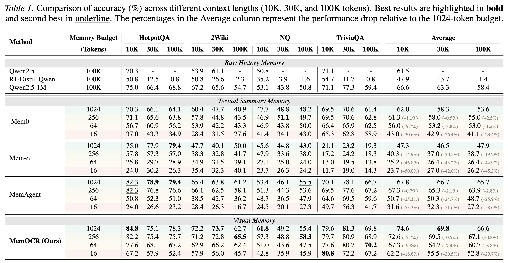
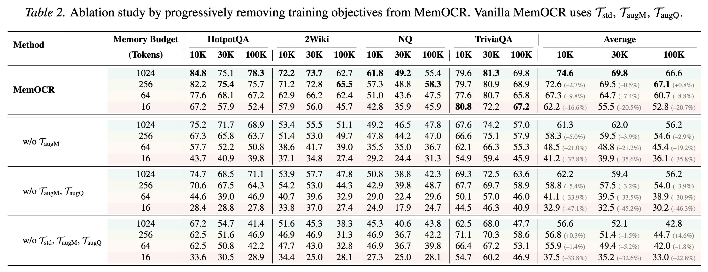
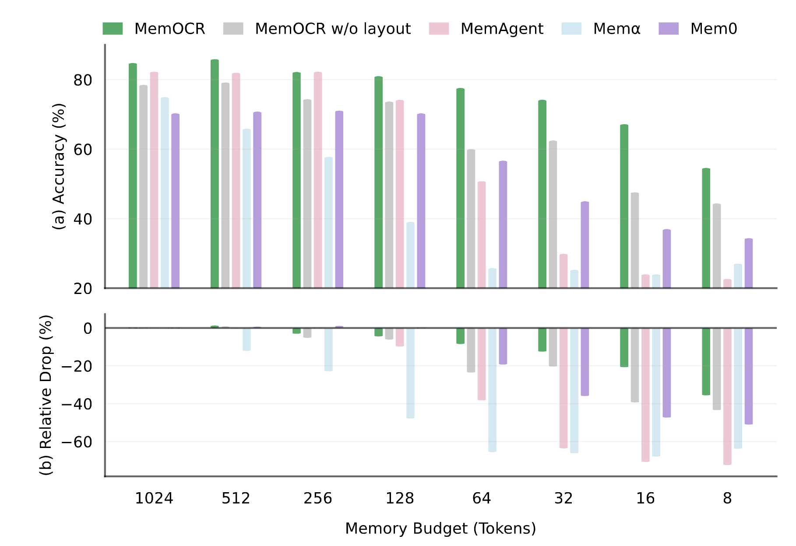
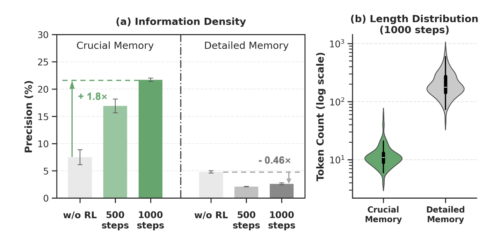

# MemOCR: Layout-Aware Visual Memory for Efficient Long-Horizon Reasoning

<div align="center">


<p align="center">
  <a href="https://arxiv.org/abs/2601.21468"></a>
  <a href="https://huggingface.co/papers/2601.21468"></a>
  <a href="https://syr-cn.github.io/MemOCR-private/"></a>
  <!-- <a href="#"></a> -->
  <a href="./LICENSE"></a>
</p>
</div>


> [!TIP]
> ### 🔥 News
> - **[2025-02]** 🥳 MemOCR code and checkpoint released!
> - **[2025-01]** 📑 MemOCR paper released on [arXiv](https://arxiv.org/abs/2601.21468) and [huggingface🤗](https://huggingface.co/papers/2601.21468)
> - **[2025-01]** 🚀 We introduce MemOCR, a memory agent capable of forming and utilizing its memory in visual form.


## 🌟 Overview

MemOCR is a visual memory agent that dynamically adapts information density during memory drafting and reading. By incorporating budget-aware training objectives and adaptive information density mechanisms, MemOCR achieves superior performance in multi-hop question answering tasks while maintaining efficient token usage.

### Key Features
- **Adaptive Information Density**: Dynamically adjusts memory content richness based on task requirements
- **Budget-Aware Training**: Optimizes memory usage with explicit token budget constraints
- **Dual-Domain Architecture**: Separate memory drafting (text domain) and reading (vision domain) processes
- **State-of-the-Art Performance**: Superior results on HotpotQA, 2WikiMultihopQA, NaturalQuestions, and TriviaQA benchmarks


<div align="center">

</div>

## 🏗️ Method

<div align="center">

</div>

MemOCR consists of two main components:

1. **Memory Drafting in Text Domain**: An LLM agent iteratively refines rich-text memory content based on question-answering feedback
2. **Memory Reading in Vision Domain**: A vision-language model processes rendered visual memory with optimized information density

The framework employs budget-aware training objectives to balance memory informativeness and token efficiency.

<div align="center">

</div>


## 📊 Results

### Main Results

<div align="center">

</div>

MemOCR achieves state-of-the-art performance across multiple multi-hop QA benchmarks while maintaining efficient memory budgets (number of tokens for memory at inference time).

### Ablation Studies

<div align="center">

</div>

### Analysis: Information Density & Budget

<div align="center">


</div>


## 🛠️ Installation

### Prerequisites
- Python 3.10
- NVIDIA GPU with CUDA support (we use CUDA 12.1)
- Compatible NVIDIA driver + CUDA runtime

### 1. Create Conda Environment

```bash
conda create -n memocr -y python=3.10
conda activate memocr
python -m pip install --upgrade pip
```

### 2. Install Dependencies

```bash
pip3 install -r requirements.txt
```

### 3. Install FlashAttention

```bash
wget -O flash_attn.whl https://github.com/Dao-AILab/flash-attention/releases/download/v2.8.3/flash_attn-2.8.3+cu12torch2.7cxx11abiFALSE-cp310-cp310-linux_x86_64.whl
pip install --no-cache-dir flash_attn.whl
```


## 🖼️ Visual Memory Rendering Server

MemOCR constructs two types of richtext-to-image rendering servers for training and evaluation:
- **Markdown Rendering** (by default)
- **HTML Rendering** (beta version)

### Start the Markdown Rendering Server

```bash
cd md2img
pip3 install -r requirements_api.txt
playwright install

python3 markdown_api_server.py
```

The server will be available at `http://localhost:9000` for rendering markdown content to images.
The interaction between the agent and the rendering server is in `recurrent/impls/call_md_renderer.py`.


## 🚀 Training

### Step 0: Prepare Training Data

We use the same training data as [MemAgent](https://github.com/BytedTsinghua-SIA/MemAgent), which can be downloaded from [HuggingFace](https://huggingface.co/datasets/BytedTsinghua-SIA/hotpotqa).

Place the downloaded files in the following structure:

```
MemOCR/
├── data/
│   └── hotpotqa/
│       ├── hotpotqa_dev.parquet
│       └── hotpotqa_train_32k.parquet
└── scripts/
    └── train.sh
```

### Step 1: Start a Ray Cluster (Multi-Node)

**On the head node:**

```bash
ray stop --force
ray start --head \
  --port=8278 \
  --dashboard-host=0.0.0.0 \
  --dashboard-port=8265
```

**On worker nodes** (replace `<HEAD_IP>` with the head node's IP):

```bash
ray stop --force
ray start --address="<HEAD_IP>:8278"
```

### Step 2: Launch Training

Run the training script from the head node:

```bash
bash scripts/train.sh
```

Training logs will be saved to:
- `./log/<EXP_LOG_NAME>.log`
- `./results/<EXP>/...`

In our paper, we use 8x8 H800 GPUs for training MemOCR.

## 📊 Evaluation

### Prepare Test Data

Our evaluation benchmark includes HotpotQA, 2WikiMultihopQA, NaturalQuestions, and TriviaQA. Pre-process the datasets using:

```bash
cd taskutils/memory_data
bash cmd-process.sh
```

### Run Evaluation

Our evaluation is conducted on 8 × H800 GPUs. Reproduce the results with:

```bash
bash scripts/eval.sh
```


## 📚 Citation

If you find MemOCR useful in your research, please consider citing:

```bibtex
@article{shi2026memocr,
  title={MemOCR: Layout-Aware Visual Memory for Efficient Long-Horizon Reasoning}, 
  author={Yaorui Shi and Shugui Liu and Yu Yang and Wenyu Mao and Yuxin Chen and Qi GU and Hui Su and Xunliang Cai and Xiang Wang and An Zhang},
  journal={arXiv preprint arXiv:2601.21468},
  year={2026},
}
```

## 🙏 Acknowledgements

This project is developed by the Meituan LongCat team, building upon several excellent open-source projects:

- **[veRL](https://github.com/volcengine/verl)** as the reinforcement learning training framework;
- **[MemAgent](https://github.com/BytedTsinghua-SIA/MemAgent)** for the `recurrent` module and training dataset;
- **[Playwright](https://github.com/microsoft/playwright)** for rendering richtext to visual memory;
- **[Qwen2.5-VL](https://huggingface.co/collections/Qwen/qwen25-vl)** as the vision-language model backbone.


## 📄 License

This project is licensed under the Apache License 2.0 - see the [LICENSE](./LICENSE) file for details.

### Dataset License

Our training and evaluation datasets are derived from open-source resources:
- **HotpotQA, 2WikiMultihopQA, Natural Questions, TriviaQA**: These datasets are sourced from Wikipedia and other publicly available corpora. The Wikipedia-derived content is licensed under **[CC BY-SA 4.0](https://creativecommons.org/licenses/by-sa/4.0/)** License.